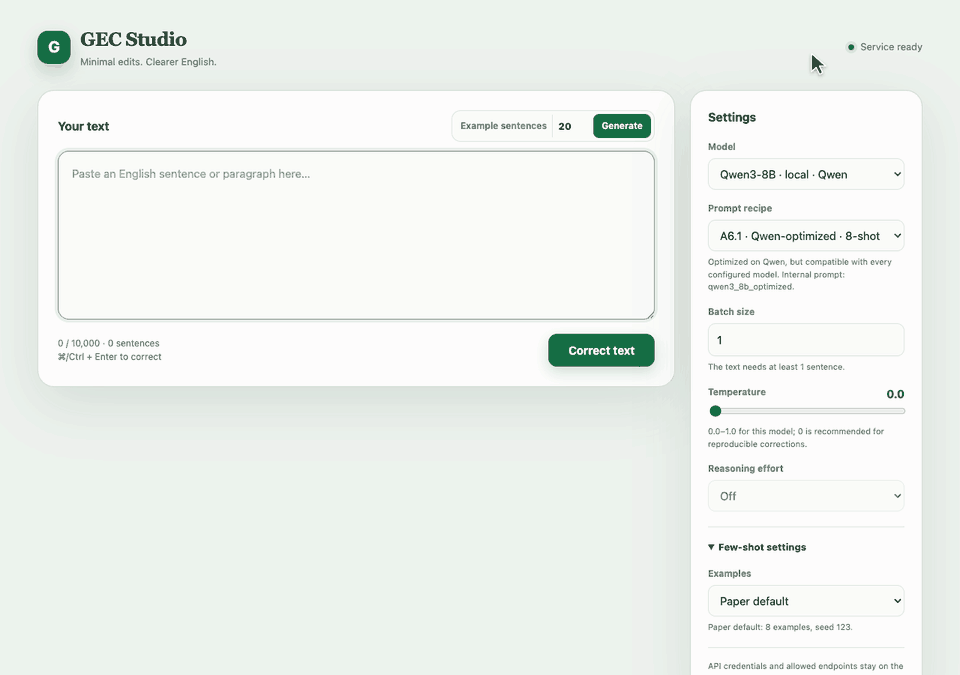

# Larger Context Window, Fewer Overcorrections: Optimizing Prompts and Batching for Minimal-Edit Grammatical Error Correction


Code and artifacts for paper **“Larger Context Window, Fewer Overcorrections: Optimizing Prompts and Batching for 
Minimal-Edit Grammatical Error Correction”**, accepted to **Findings of EMNLP 2026**.

We study taxonomy-grounded prompts, model-specific prompt optimization, and multi-sentence batching for English GEC. 
Our best configuration reaches **78.32 $F_{0.5}$ on BEA-2019 test** and **67.08 $F_{0.5}$ on CoNLL-2014 test**.

## Citation

If you find this work is useful for your research, please cite our paper:

```bibtex
@misc{karpo2026largercontextwindowfewer,
      title={Larger Context Window, Fewer Overcorrections: Optimizing Prompts and Batching for Minimal-Edit Grammatical Error Correction},
      author={Kateryna Karpo and Artem Chernodub},
      year={2026},
      eprint={2609.10810},
      archivePrefix={arXiv},
      primaryClass={cs.CL},
      url={https://arxiv.org/abs/2609.10810},
}
```

## Contents

- `src/`, `en_main.py`, `en_evaluation/`: API-model inference and evaluation
- `demo/`: configurable FastAPI service and browser UI
- `configs/`: main experiment configurations
- `src/agents/prompts/`: API-model prompt definitions
- `.claude/skills/gec-prompt-optimise/`: Claude prompt-optimization skill
- `data/`: BEA-2019 and CoNLL-2014 data 
- `results/`: predictions and evaluation reports


## Quick start

Requires Python 3.13 and [uv](https://docs.astral.sh/uv/).

```bash
uv sync
uv run python -m spacy download en_core_web_sm
cp .env.example .env  # then add the required API key
```

Run the main configurations:

```bash
uv run python en_main.py --config configs/bea_dev.yaml
uv run python en_main.py --config configs/bea_test.yaml
uv run python en_main.py --config configs/conll14_test.yaml
```


## Demo



Run the interactive FastAPI demo:

```bash
uv run gec-demo
```

Open `http://127.0.0.1:8080`. The UI lets you select a configured model,
any Appendix A recipe, decoding settings, and optional few-shot examples. Paper
defaults are selected automatically; the UI can also reproduce any deterministic
BEA-train sample by setting `n` and `seed`. Set `batch_size` to group multiple
sentences per model request; longer inputs are processed in consecutive batches.
“Generate examples” dynamically samples the requested number of erroneous
BEA-train sentences (20 by default). The same
service is available as `POST /api/correct`, with OpenAPI documentation at
`http://127.0.0.1:8080/docs` and the raw schema at `/openapi.json`. Edit
`configs/demo.yaml` to control the models
shown in the UI; API keys remain in `.env` on the server. Qwen3-8B is the
default profile, so start its local server as shown below or select another model.

For the open-weight Qwen3-8B configuration, install vLLM on a CUDA host and
start its OpenAI-compatible server:

```bash
uv pip install vllm
vllm serve Qwen/Qwen3-8B \
  --served-model-name Qwen/Qwen3-8B \
  --api-key local
uv run python en_main.py --config configs/qwen3_8b.yaml
```

The Qwen config uses the same LiteLLM-based pipeline as the commercial models.
It also preserves the reported deterministic decoding, chat-form few-shot
demonstrations, disabled thinking, and sentence-level retry for malformed batches.

Outputs are written to `outputs/<run_name>/`.

## More information

- Dataset layout and licensing: `[data/README.md](data/README.md)`
- Claude optimization skill: `[.claude/skills/gec-prompt-optimise/SKILL.md](.claude/skills/gec-prompt-optimise/SKILL.md)`

Credentials, model weights, raw API responses, and checkpoints are not included. Third-party datasets and models remain governed by their original terms.
